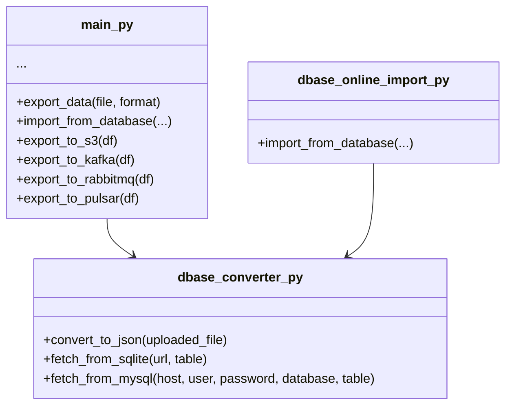

# Export App Architecture

This document provides an overview of the small FastAPI project located in `export_app/`.
It focuses on the three main modules:

- `main.py` – exposes endpoints for file export and remote database import.
- `dbase_converter.py` – helper functions to convert uploaded files to JSON and fetch
  data from SQLite or MySQL.
- `dbase_online_import.py` – a stand‑alone FastAPI app with an `/import-online-db`
  endpoint that reuses the converter utilities.

---

## Module Relationships

```mermaid
graph TD
    main[main.py] -->|uses| converter[dbase_converter.py]
    online[dbase_online_import.py] -->|uses| converter
    main -->|exposes| export[/export]
    main -->|exposes| import1[/import-online-db]
    online -->|exposes| import2[/import-online-db]
```

## Function Overview


